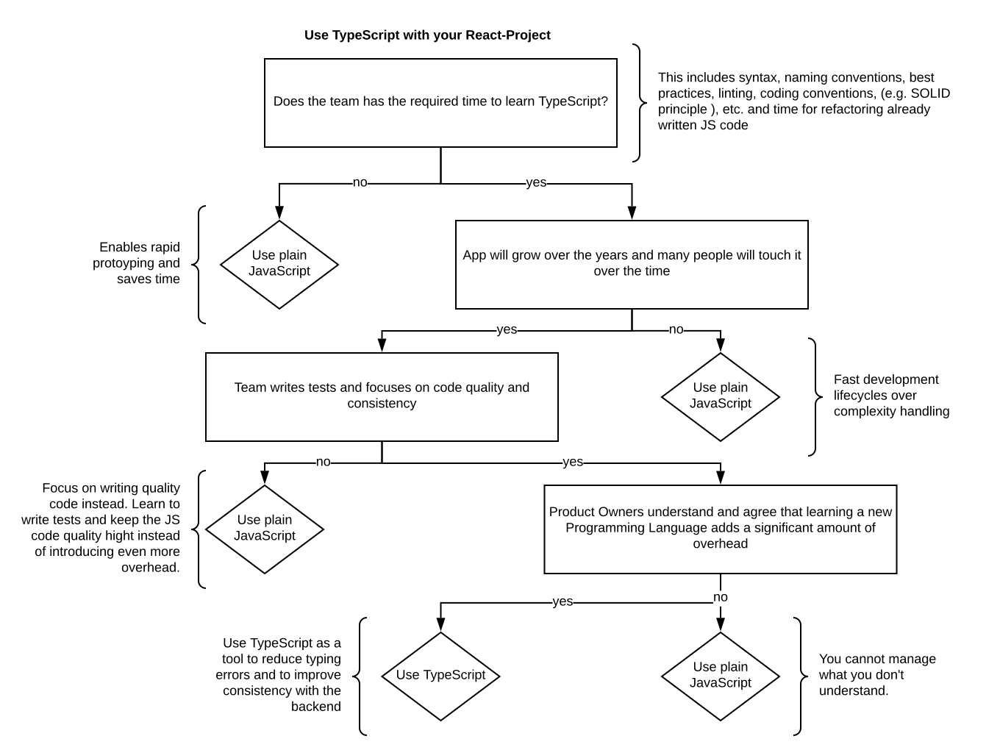

# react-with-typescript

A skeleton application using typescript and create-react-app. 

## How to add TypeScript to an existing create-react-app application?

1. Bootstrapp app with [Create React App](https://github.com/facebook/create-react-app).

`npx create-react-app my-app`

2. [Add TypeScript](https://facebook.github.io/create-react-app/docs/adding-typescript)

`npm install --save typescript @types/node @types/react @types/react-dom @types/jest`

3. Rename .js files to .tsx files 

4. Run App

`npm run start` - The app is now running on TypeScript!

## Pros & Cons of using TypeScript with React

### Typing with TypeScript

- As a typed superset of JavaScript, TypeScript verifies types on compilation
- In React world, [PropTypes](https://reactjs.org/docs/typechecking-with-proptypes.html) validate types in run-time, this is however not needed anymore if TypeScript is used. As a conclusion, if you maintain a React app that soley is based on TypeScript, PropTypes are not needed anymore.
- When using TypeScript, the best way to substitute PropTypes is to create an Interface for every component's props and state. 

[See following example](https://charleslbryant.gitbooks.io/hello-react-and-typescript/content/TypeScriptAndReact.html):

```
interface IMyComponentProps {
    someDefaultValue: string
}

interface IMyComponentState {
    someValue: string
}

export default class MyComponent extends React.Component<IMyComponentProps, IMyComponentState> {
    constructor(props : IMyComponentProps) {
        super(props);
        this.state = { someValue: this.props.someDefaultValue };
    }

    public render() {
        return (
            <div>
                Value set as {this.state.someValue}
            </div>
        );
    }
}
```

#### Pros of using TypeScript in React World

- find typing errors in compile time
- better hints and documentation within the IDE
- reduces likelihood of some kind of errors like `==` vs. `===` or retrieving data from JSON files. 
- no need for PropTypes anymore

#### Cons of using TypeScript in React World

- slower development due to learning curve and refactoring
- "TypeScript - JavaScript that scales." - worth it only if the app becomes bigger
- introduces new problems, e.g. new naming conventions needed (interfaces start with big I...)

#### Pros of staying with JavaScript in React World

- less verbose, less boilerplate code (e.g. a new interface file for every component!)
- PropTypes is not as powerful as static typing but already a good way to reduce the likelihood of typing errors

### Interoperability of TypeScript and JavaScript

- you can use JavaScript code within your TypeScript applicaiton
- you can use JavaScript based npm modules within your app
- you can use JavaScript based components within your TypeScript application

Only limitation:
- if you want to use a TypeScript component within a JavaScript React-App, you need to use PropTypes within your TypeScript application in order for the JavaScript based React-App to check for typing errors. 

### TypeScript in front & backend

- using TypeScript over the full stack of the application improves consistency of the code base
- using TypeScript soley in a React frontend however, reduces the use cases for TypeScript, leaving a lot of overhead (e.g. TypeScript configuration overhead ). 

TypeScript brings following advantags to the table: 

TypeScript Feature  | Explanation | Use Cases in React World?
------------- | ------------- | -------------
Safe typing   | Verify static typing on compile time | Improves the code quality of the React App
Inheritance & inheritance behavior on runtime  | Class inheritance & usage of interfaces | React has its own system based on nesting components (render tree) which allows very limited usage of inheritance in React world, e.g. only usage might be Utility functionalities or Services.
[mixins](https://basarat.gitbooks.io/typescript/docs/types/mixins.html) | Allow the extension of classes and functions further to inheritance | React/Redux uses the Redux middleware functionality to implement side effects like this
[dependency injection](https://nehalist.io/dependency-injection-in-typescript/) (e.g. via [inversify](http://inversify.io/)) | Inversion of control (IoC) has a lot of powerful use cases when it comes to backend programming e.g. switch database based on env, switch services and mockup services for testing, etc., | Again, React works in a different way and rather works around the render tree and the usage of Redux flags and props to switch out components.

### JSX with TypeScript 

See [TypeScript JSX documentation](https://www.typescriptlang.org/docs/handbook/jsx.html)

## Conclusion

TypeScript is a powerful tool that enables type safety in JavaScript world. Moreover, it enables a lot of principles of OO programming that are not part of the JavaScript language design. I have mentioned the most important features of TypeScript above. React however is based on its own design principles and "it helps you write a program that predictably manipulates a complex host tree in response to external events like interactions, network responses, timers, and so on." - [Dan Abramov](https://overreacted.io/react-as-a-ui-runtime/). You can use TypeScript in your React Application but you will not get the same amount of advanatages out of it as you would if used in a NodeJS backend application.

Still, TypeScript is a powerful language and is used in other frontend frameworks like Angular. The decision if you want to use TypeScript with React should be based on the properties of the development environment. See the following decision tree as a basis for your decision making:

## Decision Tree



# Create-React-App Readme

## Available Scripts

In the project directory, you can run:

### `npm start`

Runs the app in the development mode.<br>
Open [http://localhost:3000](http://localhost:3000) to view it in the browser.

The page will reload if you make edits.<br>
You will also see any lint errors in the console.

### `npm test`

Launches the test runner in the interactive watch mode.<br>
See the section about [running tests](https://facebook.github.io/create-react-app/docs/running-tests) for more information.

### `npm run build`

Builds the app for production to the `build` folder.<br>
It correctly bundles React in production mode and optimizes the build for the best performance.

The build is minified and the filenames include the hashes.<br>
Your app is ready to be deployed!

See the section about [deployment](https://facebook.github.io/create-react-app/docs/deployment) for more information.

### `npm run eject`

**Note: this is a one-way operation. Once you `eject`, you can’t go back!**

If you aren’t satisfied with the build tool and configuration choices, you can `eject` at any time. This command will remove the single build dependency from your project.

Instead, it will copy all the configuration files and the transitive dependencies (Webpack, Babel, ESLint, etc) right into your project so you have full control over them. All of the commands except `eject` will still work, but they will point to the copied scripts so you can tweak them. At this point you’re on your own.

You don’t have to ever use `eject`. The curated feature set is suitable for small and middle deployments, and you shouldn’t feel obligated to use this feature. However we understand that this tool wouldn’t be useful if you couldn’t customize it when you are ready for it.

## Learn More

You can learn more in the [Create React App documentation](https://facebook.github.io/create-react-app/docs/getting-started).

To learn React, check out the [React documentation](https://reactjs.org/).

### Code Splitting

This section has moved here: https://facebook.github.io/create-react-app/docs/code-splitting

### Analyzing the Bundle Size

This section has moved here: https://facebook.github.io/create-react-app/docs/analyzing-the-bundle-size

### Making a Progressive Web App

This section has moved here: https://facebook.github.io/create-react-app/docs/making-a-progressive-web-app

### Advanced Configuration

This section has moved here: https://facebook.github.io/create-react-app/docs/advanced-configuration

### Deployment

This section has moved here: https://facebook.github.io/create-react-app/docs/deployment

### `npm run build` fails to minify

This section has moved here: https://facebook.github.io/create-react-app/docs/troubleshooting#npm-run-build-fails-to-minify
